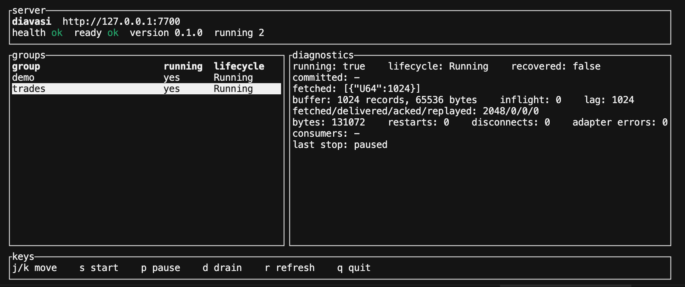

# Observability

Stage 12 makes a running server explainable. The control plane already had liveness, status, and the durable checkpoint. This page is the metrics, readiness, and diagnostics surface. Decision record: [ADR 0013](adr/0013-observability.md).

## Health and readiness

| Route | Auth | Meaning |
| --- | --- | --- |
| `GET /health` | none | The process is up. Body `ok`. |
| `GET /ready` | none | The store can be read. Body `ok`, or `not ready` with HTTP 503. |
| `GET /metrics` | bearer | Prometheus text, `text/plain; version=0.0.4`. |
| `GET /v1/groups/{id}/diagnostics` | bearer | One group's position, lag, counters, and last stop. |

`/health` does not read the store. `/ready` does. A process can be alive and not ready.

## Metrics

Names use a `diavasi_` prefix. Counters move when the event happens. Gauges are filled when `/metrics` is scraped, from groups whose runtime is up. A paused group disappears from the gauge series. Its counters stay until the process exits or the group is deleted.

Labels `group_id` and `adapter` are on the record counters. `adapter` is `synthetic` when the group has no connection, otherwise the connection kind (`postgres`, `mongodb`, `redis`, `scylla`). No metric carries a consumer id; clients choose those, so they appear in logs instead. Deleting a group removes its series.

| Metric | Kind | Labels |
| --- | --- | --- |
| `diavasi_groups_running` | gauge | none |
| `diavasi_group_records_fetched_total` | counter | `group_id`, `adapter` |
| `diavasi_group_records_delivered_total` | counter | `group_id`, `adapter` |
| `diavasi_group_records_acked_total` | counter | `group_id`, `adapter` |
| `diavasi_group_records_replayed_total` | counter | `group_id`, `adapter` |
| `diavasi_group_bytes_total` | counter | `group_id`, `adapter` |
| `diavasi_group_buffer_records` | gauge | `group_id` |
| `diavasi_group_buffer_bytes` | gauge | `group_id` |
| `diavasi_group_inflight_records` | gauge | `group_id` |
| `diavasi_group_checkpoint_lag` | gauge | `group_id` |
| `diavasi_consumer_count` | gauge | `group_id` |
| `diavasi_group_fetch_latency_seconds` | histogram | `group_id`, `adapter` |
| `diavasi_group_ack_latency_seconds` | histogram | `group_id`, `adapter` |
| `diavasi_checkpoint_write_latency_seconds` | histogram | `group_id` |
| `diavasi_group_restarts_total` | counter | `group_id` |
| `diavasi_group_recovery_failures_total` | counter | `group_id` |
| `diavasi_consumer_disconnects_total` | counter | `group_id` |
| `diavasi_group_stale_acks_total` | counter | `group_id` |
| `diavasi_group_contract_failures_total` | counter | `group_id` |
| `diavasi_adapter_errors_total` | counter | `group_id`, `adapter` |

`diavasi_group_checkpoint_lag` is records sitting in the buffer plus records assigned to a consumer and not yet acked. It is not a distance between cursor tuples. A slow consumer grows this number until the buffer cap stops further fetches. The buffer gauge stays at or under `max_buffer_records`. In-flight records sit outside that cap, bounded by the batches already assigned.

`diavasi_group_restarts_total` counts successful supervisor respawns after an unexpected task exit (transient source error, abort, panic). A pause does not increment it. `diavasi_group_recovery_failures_total` counts restarts that could not open the source; each is retried with a longer delay, from 250 ms up to 30 s.

`diavasi_group_contract_failures_total` counts groups stopped as `Failed` because the data broke the source contract. These are not restarted, so alert on any increase: the group stays stopped until an operator fixes the data or the spec and starts it.

## Diagnostics

```bash
diavasi group diagnostics demo
diavasi --output json group diagnostics demo
```

The JSON object has:

- `running` and `lifecycle`. They agree: a running group is `Running` or `Draining`; a group waiting to restart after a failure is `Recovering` with `running` false; a stopped group is `Stopped`, or `Failed` after an error a restart would repeat.
- `committed_cursor` (live engine while running, otherwise the store)
- `fetched_cursor` (live read position; null when the runtime is down, and null at the start of a stream)
- `buffer_records`, `buffer_bytes`, `inflight_records`, `consumers`
- `records_fetched`, `records_delivered`, `records_acked`, `records_replayed`, `bytes`
- `checkpoint_lag`, `restarts`, `consumer_disconnects`, `adapter_errors`
- `last_stop_reason` and `recovered`

`last_stop_reason` is `paused` after a clean pause, `drained` after a drain finished, `shutdown` after a server shutdown, the source error text after a failed read or a failed restart, `task aborted` after an abort, or `task panicked` after a panic. A transient error is retried with backoff and `running` is false until a restart succeeds. A contract error (bad data, such as a value of the wrong type or entries trimmed before delivery) is not retried: the group stays stopped with that reason until `group start`. `recovered` is true after the supervisor respawns that group in this process. Both are forgotten when the process exits. The checkpoint in the store is the durable position.

An explicit `group start` or `group resume` clears `recovered` for that group. The previous reason remains until the next exit.

## Dashboard

`diavasi tui` is a live view of the control plane. It polls `/health`, `/ready`, `/v1/status`, `/v1/groups`, and the diagnostics of the highlighted group. It uses the same `--url` and `--token` as the other client commands (`DIAVASI_URL`, `DIAVASI_API_TOKEN`).

```bash
export DIAVASI_URL=http://127.0.0.1:7700
export DIAVASI_API_TOKEN=dev-token
diavasi tui
```



The screen has four panes.

**server.** The control-plane URL, `health` and `ready` (`ok` or `down`), the server version, and how many groups are running.

**groups.** One row per group: id, whether the runtime is up, and the lifecycle (`Running`, `Stopped`, and the other states). The highlighted row is the group whose diagnostics are on the right. In the screenshot, `demo` and `trades` are both running, and `trades` is selected.

**diagnostics.** The same fields as `diavasi group diagnostics`:

- `running`, `lifecycle`, and `recovered`
- `committed` and `fetched` cursors. `-` means there is no position yet. A JSON array such as `[{"U64":1024}]` is the logical cursor.
- `buffer` records and bytes, `inflight`, and `lag` (buffer records plus in-flight records)
- `fetched/delivered/acked/replayed`, payload `bytes`, `restarts`, `disconnects`, and `adapter errors`
- `consumers`, or `-` when nobody is joined
- `last stop`, or `-` when this process has not stopped the group

In the screenshot, `trades` has fetched 1024 records into a full buffer, nothing is in flight, so lag is 1024, and the last stop in this process was `paused`. Nothing has been acked, so the committed cursor is still `-`.

**keys.** Shown on the bottom bar:

| Key | Action |
| --- | --- |
| `j` / `k` | Move the selection down or up. Arrow keys do the same. |
| `s` | Start the selected group. |
| `p` | Pause it (the runtime stops, the definition stays). |
| `d` | Drain it: deliver what is already fetched, read nothing new, then stop. |
| `r` | Refresh now. |
| `q` | Quit. Esc and Ctrl-C also quit. |

The view refreshes about once a second. A failed request is printed in red in the diagnostics pane. The last good group list stays on screen.

## Logs

`diavasi serve` writes text logs. `RUST_LOG` selects the filter and defaults to `info`.

```bash
DIAVASI_LOG_FORMAT=json diavasi serve --bind 127.0.0.1:7700 --data-bind 127.0.0.1:7710 \
  --store /tmp/diavasi/meta.redb --token "$DIAVASI_API_TOKEN"
```

`DIAVASI_LOG_FORMAT=text` is the default. Any other value is rejected with a line on stderr and the text formatter is used.

Fetch failures, ack failures, restarts, and consumer disconnects include `group_id`. Disconnects and data-plane ack failures also include `consumer_id`.

`diavasi_group_stale_acks_total` counts acks for batches that were no longer in flight, usually because the batch timed out and was delivered again. A rising count means consumers take longer than `batch_timeout_ms`.

Fetch and ack use debug spans named `group_fetch` and `group_ack`. The default `info` filter does not enable them. `RUST_LOG=debug` prints them. There is no trace exporter in this stage.
